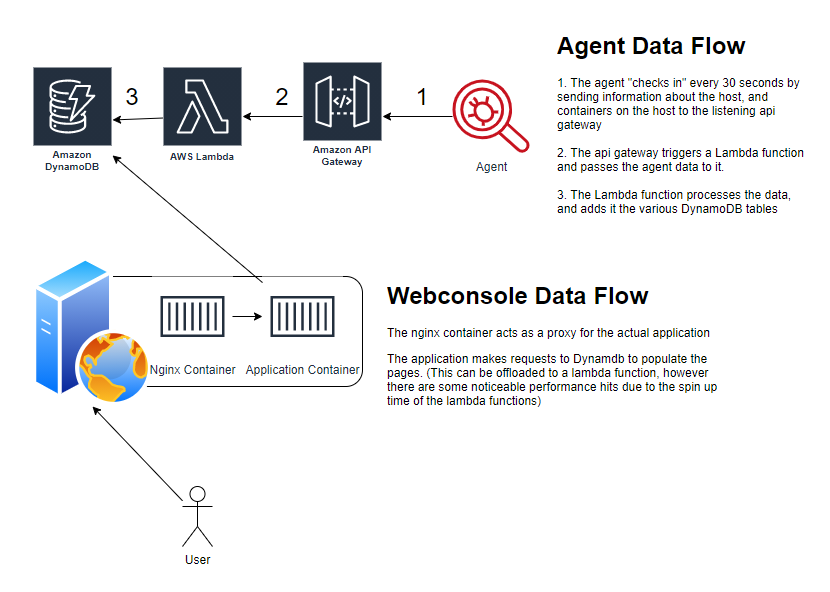

# Container Security Platform

This will grow into a container security platform which monitors the changes on the containers file systems, Proceses running, network connections, and other bits of information. Additionally you'll be able to request files from the container, and request the entire container image for further analysis.

It is designed to be deployed as a sidecar container, currently the only requirement is so mount the docker.sock into the container. As this project evolves I expect the need for various other capabilities will become necessary. 

For Kubernetes, please use the daemonset for deployment across the entire cluster.

## High Level Topology

### TODO

leverage /proc to track container processes
mount /proc as ro into the container at /hostproc

leveage the /sys/fs/cgroup folder to monitor container usages
eg. /sys/fs/cgroup/cpu/docker/<CONTAINER ID>/cpuacct.usage_percpu_sys
mount the /sys/fs/cgroup folder into the container as ro at /hostsys